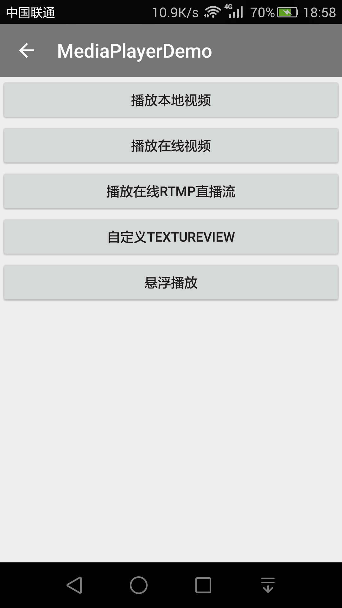
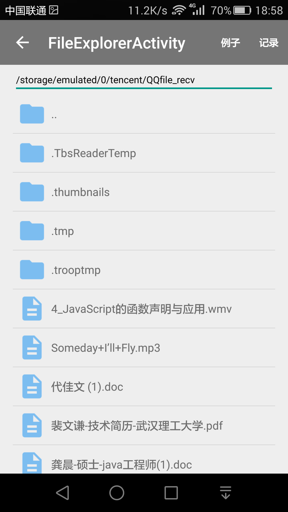
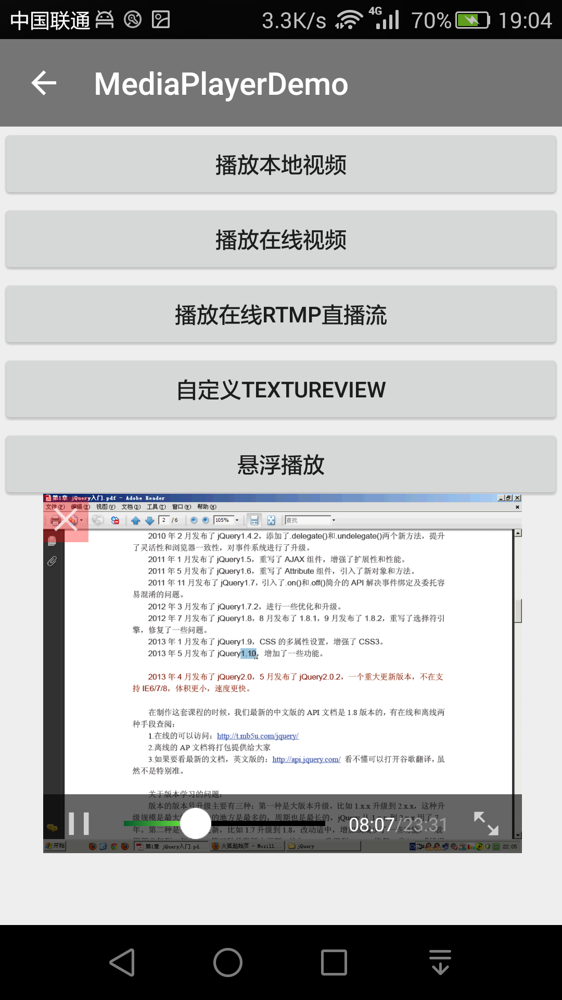

VersatileVitamioPlayer
---

## 用处

该仓库是[Vitamio](https://www.vitamio.org/)的例子，此播放器具有全格式的解码能力，现在实现了播放本地视频功能和播放线上视频功能。







### Gradle配置

```
compile 'com.charonchui.vitamio:vitamio:4.2.2'
```
### Maven配置

```xml
<dependency>
  <groupId>com.charonchui.vitamio</groupId>
  <artifactId>vitamio</artifactId>
  <version>4.2.2</version>
</dependency>
```

## 联系方式
  QQ:1196681436
  Weibo:http://www.weibo.com/u/1693069642

[Vitamio](https://www.vitamio.org/)的例子，欢迎提出意见，提交代码。

